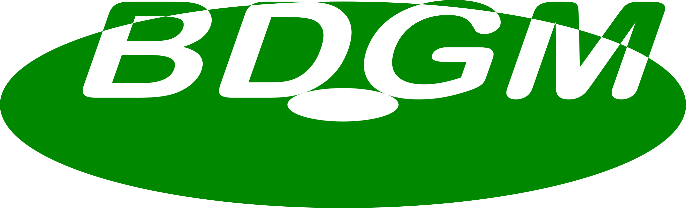

# Blu-Ray Disc Game

BDGM is a UDF-based specification for storing and playing cross-platform games on optical discs (CD, DVD, Blu-Ray).
See specification at <https://github.com/yesser-studios/bdgm/blob/main/spec.md>.

## `bdgm-play`

`bdgm-play` is a simple CLI player for BDGM discs and images.

### Installation

`bdgm-play` is available on the Microsoft Store and crates.io.

#### Microsoft Store

<a href="https://apps.microsoft.com/detail/9PD4TRWXK7KX?referrer=appbadge&mode=full" target="_blank"  rel="noopener noreferrer">
    
</a>

https://apps.microsoft.com/detail/9PD4TRWXK7KX

#### Cargo (crates.io)

To install, you need Cargo and build tools for your platform.
```
cargo install bdgm-play
```

### Usage

See <https://github.com/yesser-studios/bdgm/blob/main/instructions.md>.

## `bdgm-build`

`bdgm-build` is a simple CLI BDGM image authoring tool.

### Installation

`bdgm-build` is currently only available on crates.io. To install, you need Cargo and build tools for your platform.
```
cargo install bdgm-build
```

### Usage

Create a disc root directory following the [specification](https://github.com/yesser-studios/bdgm/blob/main/spec.md).
To create an image, run:
```
bdgm-build path/to/disc/root/ image-bd.bin
```

This will create a UDF 2.50 image for burning **Blu-Ray discs**.
**To make a DVD or CD image, use the `--dvd` flag to use UDF 2.01 instead**:
```
bdgm-build path/to/disc/root --dvd image-dvd.bin
```

To burn the image, use any image burning software such as ImgBurn, K3b or xorriso.  
For example, with xorriso:
```
sudo xorriso -as cdrecord -v dev=/dev/sr0 image-bd.bin
```
***Double-check the device path before burning!***

## License

All code is licensed under the [MIT license](./LICENSE.md).  
The BDGM logo is licensed under a [separate license](logo-license.md). The copyright holder for the BDGM logo is [APlum](https://github.com/AnimalPlum).
